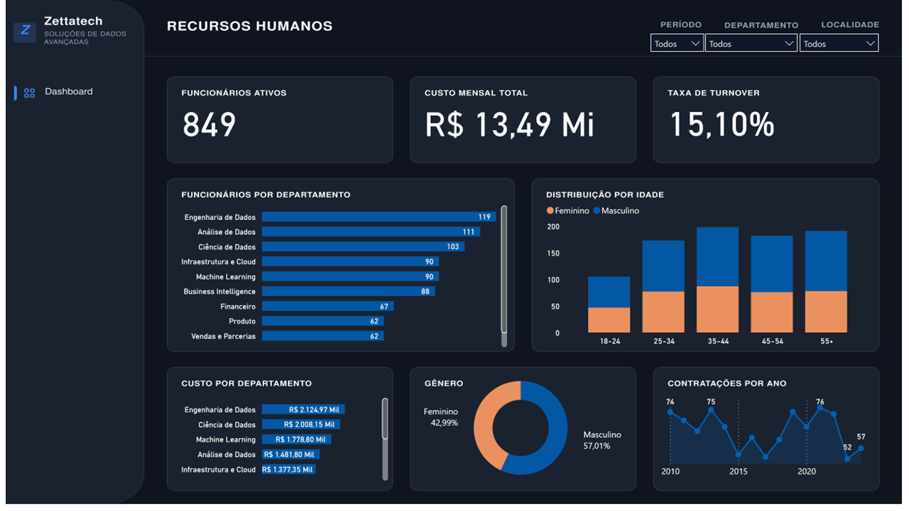
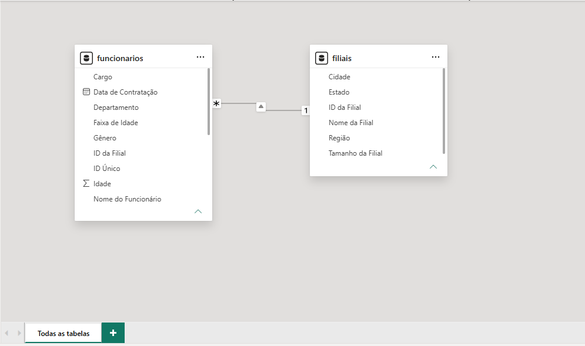

# Dashboard de Recursos Humanos - Zettatech
### Projeto Prático de Análise e Engenharia de Dados (End-to-End)

[](https://powerbi.microsoft.com/)
[](https://learn.microsoft.com/dax/)
[](https://www.python.org/)
[](https://pandas.pydata.org/)
[](https://powerbi.microsoft.com/)

---

🔗 [**Clique aqui para acessar o Dashboard Interativo**](https://app.powerbi.com/view?r=eyJrIjoiZjkxYTI4MDctMjE1MC00YzA0LThiOTctYmFkMjM2YWI0YTQ3IiwidCI6IjQwNTBmNTliLTViYTItNGEwOS04NDU4LWI2MjUwOWM0Yzk3ZCJ9)

---

## Sobre o Projeto

Este projeto consiste em uma solução analítica *End-to-End* de **People Analytics** desenvolvida para a **Zettatech - Soluções de Dados Avançadas**, focada em apoiar a gestão executiva de Recursos Humanos com visão estratégica sobre a força de trabalho. 

A aplicação permite monitorar métricas vitais da organização, como a distribuição de colaboradores ativos por departamento, folha salarial total, taxa de turnover, perfil demográfico (gênero e faixas etárias) e o histórico de contratações ao longo dos anos.

---

## Preview do Dashboard



### Principais Funcionalidades & Filtros Interativos:
* **Filtros Globais:** Seleção dinâmica por **Período**, **Departamento** e **Localidade (Filial/Região)**.
* **Leitura Executiva em Dark Theme:** Layout moderno de alto contraste projetado para minimizar o cansaço visual e destacar informações essenciais.

---

## Principais Indicadores (KPIs)

| Indicador | Valor / Métrica | Descrição |
| :--- | :--- | :--- |
| **Funcionários Ativos** | **849** | Colaboradores com vínculo ativo na empresa |
| **Custo Mensal Total** | **R$ 13,49 Mi** | Investimento salarial bruto mensal consolidado |
| **Taxa de Turnover** | **15,10%** | Percentual de colaboradores inativos/desligados na base |
| **Proporção por Gênero** | **57,01% Masc / 42,99% Fem** | Distribuição demográfica de gênero |

---

## Visões Analíticas da Aplicação

1. **Volume por Departamento:** Destaque para as áreas de tecnologia e dados com maior *headcount* — **Engenharia de Dados (119)**, **Análise de Dados (111)** e **Ciência de Dados (103)**.
2. **Custo Orçamentário por Departamento:** Mapeamento financeiro liderado por **Engenharia de Dados (R$ 2.124,97 Mil)** e **Ciência de Dados (R$ 2.008,15 Mil)**.
3. **Distribuição por Idade & Gênero:** Gráfico empilhado comparando a força de trabalho masculina e feminina distribuída nas faixas de 18-24, 25-34, 35-44, 45-54 e 55+ anos.
4. **Contratações por Ano:** Análise histórica de expansão da empresa, acompanhando picos e vales de recrutamento entre 2010 e 2023.

---

## Arquitetura e Modelagem de Dados

O modelo dimensional foi desenhado no padrão **Star Schema (Esquema em Estrela)**:

* **Tabela Fato (`funcionarios`):** Contém os 1.000 registros detalhados dos colaboradores (Salário, Cargo, Departamento, Data de Contratação, Status, Idade, Gênero).
* **Tabela Dimensão (`filiais`):** Tabela de apoio cadastral com as 10 filiais (Cidade, Estado, Região, Porte).



---

## Estrutura de Medidas DAX

Para manter a governança do modelo de dados no Power BI, todas as fórmulas DAX foram categorizadas em pastas de trabalho:

### Pasta `KPIs`
```dax
// Quantidade Total de Funcionários Cadastrados
Qtd Funcionários = COUNTROWS(funcionarios)
```
```dax
// Funcionários Ativos na Organização
Funcionários Ativos = 
CALCULATE(
    [Qtd Funcionários], 
    funcionarios[Status do Funcionário] = "Ativo"
)
```
```dax
// Taxa de Turnover (%)
Taxa de Turnover (%) = 
DIVIDE(
    CALCULATE([Qtd Funcionários], funcionarios[Status do Funcionário] = "Inativo"), 
    [Qtd Funcionários], 
    0
)
```
```dax
// Custo Mensal Total
Custo Mensal Total = SUM(funcionarios[Salário])
```

### Pasta `Visuais`
```dax
// Percentual da força de trabalho por Gênero
% por Gênero = 
DIVIDE(
    [Qtd Funcionários], 
    CALCULATE([Qtd Funcionários], ALL(funcionarios[Gênero])), 
    0
)
```
```dax
// Folha Salarial Totalizada por Departamento
Custo por Departamento = SUM(funcionarios[Salário])
```
```dax
// Evolução Acumulada de Contratações
Funcionários Contratados Acumulados = 
CALCULATE(
    [Qtd Funcionários],
    FILTER(
        ALLSELECTED('funcionarios'[Data de Contratação]),
        'funcionarios'[Data de Contratação] <= MAX('funcionarios'[Data de Contratação])
    )
)
```

---

## Design & UI/UX (Dark Mode)

A interface foi concebida com foco em **Dashboard Design Executivo**:
* **Fundo:** Tom azul marinho escuro `#0D1117` / `#161B22` para reduzir fadiga visual.
* **Cartões Flutuantes:** Elementos arredondados `#1E293B` trazendo efeito de profundidade.
* **Cores de Destaque:** 
  * Azul `#0066CC` para dados gerais e representação masculina.
  * Laranja/Terracota `#E07A5F` para o público feminino.
  * Branco `#FFFFFF` em tipografia de alto contraste para números-chave.

---

## Autor

Desenvolvido por **Isaias Santos**

* **LinkedIn:** [linkedin.com/in/isaiassousadossantos](https://www.linkedin.com/in/isaiassousadossantos/)
* **Portfólio:** [isaiassantos.works](https://isaiassantos.works/)
